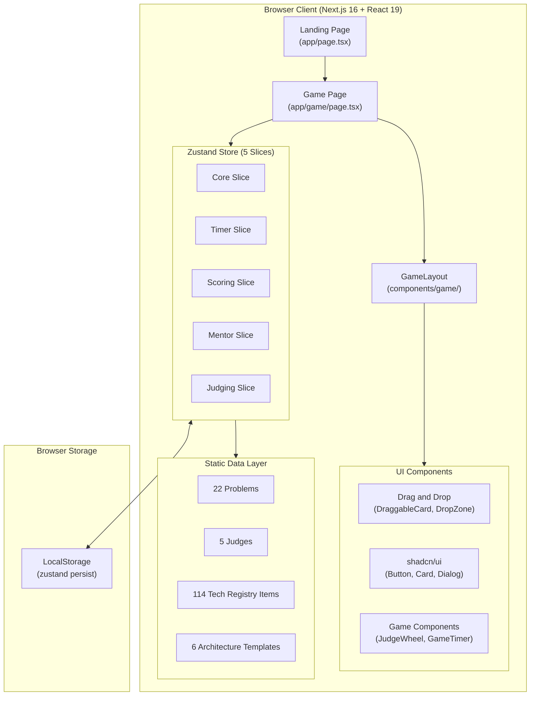
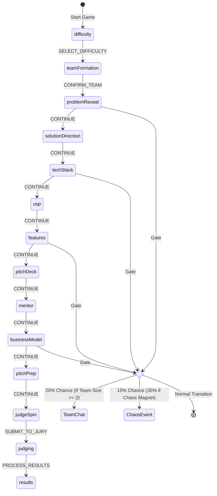
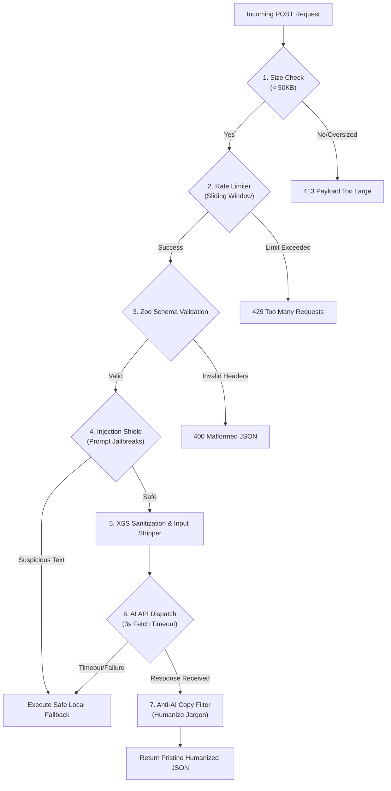

<div align="center">

# THE HACKATHON SIMULATOR

### Build. Ship. Survive.

*A gamified, turn-based hackathon experience, from team assembly to final judging, built entirely in the browser.*

[](https://nextjs.org/)
[](https://react.dev/)
[](https://typescriptlang.org/)
[](https://zustand-demo.pmnd.rs/)
[](https://www.framer.com/motion/)
[](https://opensource.org/licenses/MIT)

<br/>

> Ever wondered what it feels like to compete in a hackathon without leaving your desk?
>
> The Hackathon Simulator drops you into a timed, pressure-cooker scenario where every decision, from your team configuration to your elevator pitch, determines whether you walk away with the trophy or crash at compile time.

<br/>

[**Play Now**](#getting-started) | [**Documentation**](#architecture) | [**Report Bug**](https://github.com/udaysharmadev/The-Hackathon-Simulator/issues) | [**Request Feature**](https://github.com/udaysharmadev/The-Hackathon-Simulator/issues)

</div>

---

## Table of Contents

- [Overview](#overview)
- [Key Features](#key-features)
- [Architecture](#architecture)
  - [High-Level Architecture](#high-level-architecture)
  - [Zustand State Architecture](#zustand-state-architecture)
- [The 14-Stage Game Pipeline](#the-14-stage-game-pipeline)
- [Teammate & AI Co-Founder System (v2.0)](#teammate--ai-co-founder-system-v20)
  - [Teammate Personalities](#teammate-personalities)
  - [Interactive Advice & Gating](#interactive-advice--gating)
  - [Crew Voting Conflict Engine](#crew-voting-conflict-engine)
- [Pitch Deck Builder (v1.5)](#pitch-deck-builder-v15)
- [Scoring Engine & Point System](#scoring-engine--point-system)
  - [Judge Personality Profiles & Weights](#judge-personality-profiles--weights)
  - [Synergy & Modifier Rules](#synergy--modifier-rules)
  - [Grade Thresholds](#grade-thresholds)
- [Security Audits & Hardened APIs](#security-audits--hardened-apis)
  - [Multi-Provider AI Setup](#multi-provider-ai-setup)
  - [Sliding Window Rate Limiter](#sliding-window-rate-limiter)
  - [Input Validation & XSS Sanitization](#input-validation--xss-sanitization)
  - [Prompt Injection Shield](#prompt-injection-shield)
  - [Timeout & Payload Protections](#timeout--payload-protections)
- [Anti-AI Language Filters & Humanization](#anti-ai-language-filters--humanization)
- [Chaos Engine](#chaos-engine)
- [Tech Stack](#tech-stack)
- [Project Structure](#project-structure)
- [Getting Started](#getting-started)
- [Contributing](#contributing)
- [License](#license)

---

## Overview

The Hackathon Simulator is a single-player, turn-based strategy simulation built with Next.js 16, React 19, and Zustand 5. It faithfully recreates the entire lifecycle of a hackathon: selecting a difficulty level, assembling a balanced team of developers and designers, receiving a randomized problem statement, building an architecture stack with intelligent recommendation matrices, prioritizing features, organizing a presentation deck outline, consulting co-founder mentors, preparing a pitch, and defending your project before specialist judges.

The core gameplay is a focused turn-based challenge with a global countdown timer. Every choice you make silently adjusts internal scores across four main categories, with teammates and AI co-founders actively auditing your decisions. At the end, a randomly selected judge evaluates your run and delivers personalized, context-aware commentary, or a brutal roast, based on every selection you made.

---

## Key Features

- **The 14-Stage Pipeline**: From choosing difficulty and forming your crew to the compiler animation and results dashboard.
- **Teammates & Co-Founders (v2.0)**: Onboard 4 unique teammates who offer active advice and spark realistic voting conflicts on strategies.
- **Pitch Deck Builder (v1.5)**: Assemble a slide deck from 31 available components, evaluated on logical flow, storytelling, and clarity.
- **Hardened Security Architecture**: Absolute protection against exploitation, implementing rate limiters, payload controls, and prompt injection shields.
- **Multi-Provider AI Fallbacks**: Automatic routing between OpenAI, OpenRouter, and Gemini for roast generation, with local procedural fallbacks.
- **Anti-AI Copier Filter**: Dynamic text cleaning that converts generic AI jargon and removes emoji bloat, ensuring roasts and PRDs read naturally.
- **Vector Recommendation Engine**: Adaptive tech recommendations matching 42 unique combinations of solution directions and USPs.
- **Persistent Achievement Tracker**: 13 unique milestones stored in LocalStorage alongside run histories and telemetry charts.

---

## Architecture

### High-Level Architecture



### Zustand State Architecture

The central game state is structured into five logical slices. This structure supports high modularity and keeps state management clean. The Core Slice handles the stage machine, Timer Slice handles the countdown, Scoring Slice handles the point system, Mentor Slice tracks teammate interactions, and Judging Slice stores persistent feedback and achievements.

---

## The 14-Stage Game Pipeline

The simulation implements a linear stage machine. Players progress turn by turn, with chaos events and co-founder conversations triggering dynamically at transition gates:



---

## Teammate & AI Co-Founder System (v2.0)

Compete alongside a simulated product team. Rather than building solo, you assemble a squad that reacts directly to your scoping and architectural choices.

### Teammate Personalities

You can choose from four core specialist roles at the start of the game, each with distinct preferences:

- **The Builder (Backend / AI)**: Focuses on technical feasibility and scaling databases. Prefers standard templates like Node.js or FastAPI, and hates over engineering.
- **The Designer (UI / UX)**: Evaluates user friction, styling, and visual onboarding flows. Prioritizes stunning screens and hates headless architectures.
- **The Dreamer (AI / Innovations)**: Pushes for cutting-edge frameworks, vector registries, and highly innovative USPs.
- **The Founder (Strategy / Business)**: Keeps an eye on market size, LTV, pricing models, and pitch narrative clarity.

### Interactive Advice & Gating

Using a **Help Token**, you can request strategic feedback from a teammate once per stage:
- **Observation**: What the teammate notices about your current project state.
- **Concern**: What technical or commercial risk your choice introduces.
- **Recommendation**: A concrete actionable change proposed by the teammate.
- **Expected Impact & Tradeoffs**: The numeric score changes that will apply if you follow the advice.

Teammate suggestions are gated using a **Stage Relevancy Checker**. A teammate will refuse to offer advice if the current stage is outside their expertise. For example, a frontend designer will stay silent during database migration setup, keeping advice focused and contextually sound.

### Crew Voting Conflict Engine

When choosing a **Unique Selling Proposition (USP)** or **Business Model**, you can initiate a **Crew Vote** to secure alignment. We implemented a realistic conflict engine:

- **Enthusiastic Consensus**: If an option is outstanding, which means average scores exceed 75% or a key metric is above 85%, the entire crew votes **YES** in unison. This looks realistic because everyone recognizes a great idea.
- **Dynamic Split Voting (Conflict)**: For standard options, teammates vote individually based on role preferences. They will conflict with each other by voting **NO** on ideas that do not fit their specific domain:
  - Backend developers vote **NO** on decentralized exchange structures, complaining about race conditions and database locks.
  - Designers vote **NO** on developer API models, pointing out that a headless product gives the judges nothing to look at.
  - Strategists vote **NO** on transaction models with thin margins, pointing out low LTV ratios.
  - If a majority approves, the strategy is applied and grants a **+5 Bonus Points** team alignment boost.

---

## Pitch Deck Builder (v1.5)

Players must organize a cohesive presentation deck to convince the jury. The deck builder lets you drag and drop slides from a pool of **31 available components** into an ordered outline of up to 10 slots.

An evaluation engine checks your slide order and provides analytical critiques:
- **Problem before Solution**: Placing the customer pain slide before the solution slide increases clarity, boosting scores.
- **Tech before Problem Penalty**: Leading with backend architecture diagrams before stating the customer problem causes a major deduction.
- **Wedge Sequence**: Placing TAM/SAM/SOM, competitor moats, and business models in consecutive order yields a large business score bonus.

---

## Scoring Engine & Point System

The game implements a multi-axis scoring matrix. Every decision silently updates hidden variables, which are compiled during judging.

**Point Formula:**
```
Weighted Score = (Innovation x W_inno) + (Execution x W_exec) + (Design x W_des) + (Pitch x W_pit)
Final Score = Clamped (Weighted Score + Synergy Bonuses + Modifier Adjustments, 0, 100)
```

### Judge Personality Profiles & Weights

The final judge you face heavily influences how your categories are weighted. Each judge has a distinct background and cares about different things:

| Judge Name | Title & Profile | Innovation | Execution | Design | Pitch | Focus Areas |
|---|---|---|---|---|---|---|
| **Uday Sharma** | EdTech Creator & Hackathon Specialist | 25% | **40%** | 10% | 25% | MVP Scoping, Rapid Prototyping, User Validation, Product Practicality |
| **Bart** | Startup Founder | **35%** | 15% | 10% | **40%** | Startup Building, Product Strategy, Growth Hack, Product-Market Fit |
| **Nishika** | Corporate Product Designer / UI-UX Specialist | 10% | 15% | **50%** | 25% | UI/UX Design, Accessibility Scales, User Flows, Design Systems |
| **Sejal** | Business Analyst | 15% | 30% | 10% | **45%** | Business Strategy, Market Analysis, Revenue Models, Data-Driven Decisions |
| **Jitu** | Professor & Academic Mentor | 25% | 25% | 25% | 25% | CS Fundamentals, Software Engineering, System Design, Technical Feasibility |

### Synergy & Modifier Rules

- **Tech Synergies**: Combining compatible tools triggers bonus multipliers.
- **Strategic Modifiers**: Rules that alter calculations. For example `LIMITED_BUDGET` rejects high-overhead infrastructure like AWS and PostgreSQL, penalizing execution. `FAST_SHIP` reduces scores if you attempt to build more than two Must-Have features.

### Grade Thresholds

| Grade | Score Range | Verdict |
|---|---|---|
| **S** | 94 to 100 | Venture-Scale Unicorn Potential |
| **A** | 84 to 93 | High-Growth Accelerator Target |
| **B** | 72 to 83 | Promising Seed Bootstrapper |
| **C** | 60 to 71 | Standard Lifestyle Business |
| **D** | 48 to 59 | Compile Failed (Duct-taped Prototype) |
| **F** | Below 48 | Compile Failed (Digital Smoke) |

---

## Security Audits & Hardened APIs

All AI endpoints (including PRD generation, custom problem creation, and final project roasts) are protected by a hardened server architecture in `app/api/generate-roast/route.ts`, preventing data leaks or server load issues.



### Multi-Provider AI Setup

The platform does not rely on a single AI provider. The backend logic checks environment variables securely and routes the generation request in the following priority order:
1. **OpenAI API** (`gpt-4o-mini`) via `OPENAI_API_KEY`.
2. **OpenRouter API** (`openai/gpt-4o-mini`) via `OPENROUTER_API_KEY`.
3. **Google Gemini API** (`gemini-2.5-flash:generateContent`) via `GEMINI_API_KEY`.

If API keys are missing, fake placeholders, or network requests time out, the system automatically falls back to an internal **Procedural Roast Generator**, ensuring players always receive feedback instantly without breaking the game flow.

### Sliding Window Rate Limiter

Implemented in `lib/rateLimit.ts`, the rate limiter tracks client IPs using a sliding window buffer:
- **Configuration**: Maximum of 10 requests per minute per IP.
- **Memory Leak Protection**: Runs active cache pruning every 10 minutes, clearing stale timestamps and freeing up memory.
- **Upstream Proxy Support**: Extracts real client IPs securely, parsing headers to prevent IP spoofing.

### Input Validation & XSS Sanitization

- **Zod Schemas**: Every API payload is verified against strict schemas. Unexpected parameters are discarded, and string lengths are clamped to prevent buffer overloads.
- **XSS Sanitizer**: The system strips HTML tags and escapes characters (like `<` to `&lt;`), rendering user inputs safe for display in React components.

### Prompt Injection Shield

An active text scanner in `lib/security.ts` scans all user inputs for jailbreak attempts:
- Identifies common attack signatures, such as "ignore previous instructions", "system override", or "developer mode".
- **Silent Defensive Action**: If a prompt injection attempt is detected, the API blocks the request to external LLMs and redirects to the local procedural fallback generator, logging the IP address for security audits.

### Timeout & Payload Protections

- **Oversized Payload Rejections**: Inspects the `Content-Length` header, rejecting requests larger than 50KB immediately to protect server bandwidth.
- **Fetch Timeout Aborts**: Dispatches network requests with a 10-second timeout. If the AI model lags, an `AbortController` terminates the connection, switching immediately to local procedural fallbacks.

---

## Anti-AI Language Filters & Humanization

To maintain a professional, natural, and engaging tone, all generated text passes through a humanization filter:

1. **Jargon Stripping**: Searches for and removes typical AI copywriter words, such as "delve", "realm", "landscape", "testament", "seamless", "robust", "groundbreaking", "ever-evolving", "foster", and "pivotal".
2. **Quote Normalization**: Converts curly quotes to clean straight quotes to prevent visual syntax issues.
3. **Typography Cleanup**: Automatically removes markdown bold tags and cleans up spacing or punctuation anomalies.
4. **Absolute Emoji and Em dash Ban**: Strips all em dashes and emojis, keeping text readable and professional. We use commas and periods instead.

---

## Chaos Engine

The Chaos Engine introduces unpredictable events that interrupt gameplay between stage transitions. Each event presents a binary choice with meaningful tradeoffs covering technical failures (spilled energy drinks, API outages), team conflicts, sponsor unlocks, and last-minute jury mandate pivots. Events are selected using a weighted random algorithm that excludes previously triggered incidents.

---

## Tech Stack

| Tool | Version | Purpose |
|---|---|---|
| **Next.js** | 16.2 | Asynchronous React Meta-Framework with App Router |
| **React** | 19.2 | Dynamic Component Rendering Engine |
| **Zustand** | 5.0 | Persistent State Store with Slice Architecture |
| **Framer Motion** | 12.4 | Fluid Transitions, Springs, and SVG Animations |
| **@dnd-kit** | 6.3 | Drag-and-Drop system for Tech Stack & Features |
| **Tailwind CSS** | 4.x | Utility-first Design Tokens and Layout Styling |
| **Lucide React** | 1.17 | Clean, Scalable Monochromatic Icons |
| **Web Audio API** | Native | Real-time Synthesized Audio Chords (Zero Media Assets) |

---

## Project Structure

```
The-Hackathon-Simulator/
│
├── app/                              # Next.js App Router Pages
│   ├── layout.tsx                    # Global Fonts, Metadata, and SEO
│   ├── page.tsx                      # Landing Lobby Page
│   ├── globals.css                   # Tailwind Design Tokens and Styles
│   │
│   ├── game/
│   │   └── page.tsx                  # Main Orchestrator and 14 Stage Components
│   │
│   ├── results/
│   │   └── page.tsx                  # Static Results Page with Radar Charts
│   │
│   └── api/                          # Hardened Backend APIs
│       └── generate-roast/           # Live Project Roast API (OpenAI/OpenRouter/Gemini)
│
├── components/
│   ├── drag-drop/                    # Accessible @dnd-kit Assemblies
│   ├── game/                         # Timer, SVG Roulette, Result Screens
│   └── ui/                           # Primitive shadcn components
│
├── data/                             # Curated Game Data
│   ├── architectureTemplates.ts      # 6 Solution-specific Slots
│   ├── techRegistry.ts               # 114 Curated Technologies
│   ├── judges.ts                     # Uday, Bart, Nishika, Sejal, Jitu data
│   ├── chaosEvents.ts                # 10 Weighted Random Incidents
│   └── modifiers.ts                  # 21 Rule modifiers
│
└── lib/                              # Logic Utilities
    ├── rateLimit.ts                  # IP sliding-window tracker
    ├── security.ts                   # XSS, timeout, and injection shields
    ├── pitchDeckEvaluator.ts         # Slide layout analysis
    ├── archetypes.ts                 # Project Archetype Classifier
    └── scoring.ts                    # Scoring Engines
```

---

## Getting Started

### Prerequisites

- **Node.js** version 18.0 or higher
- **npm** version 9.0 or higher

### Installation

1. Clone the repository:
   ```bash
   git clone https://github.com/udaysharmadev/The-Hackathon-Simulator.git
   cd The-Hackathon-Simulator
   ```

2. Install dependencies:
   ```bash
   npm install
   ```

3. Start the local development server:
   ```bash
   npm run dev
   ```

Open **http://localhost:3000** in your browser to launch the lobby.

---

## Contributing

We welcome contributions to expand the simulator. To get started:

1. **Fork** the repository.
2. Create a feature branch: `git checkout -b feature/amazing-feature`.
3. Commit your changes with clear descriptions: `git commit -m "feat: add robust IoT database templates"`.
4. Push your branch: `git push origin feature/amazing-feature`.
5. Open a Pull Request.

Please ensure all additions compile cleanly and include appropriate TypeScript interfaces in `types/game.ts`.

---

## Star History

<a href="https://www.star-history.com/?repos=udaysharmadev%2FThe-Hackathon-Simulator&type=date&legend=top-left">
 <picture>
   <source media="(prefers-color-scheme: dark)" srcset="https://api.star-history.com/chart?repos=udaysharmadev/The-Hackathon-Simulator&type=date&theme=dark&legend=top-left" />
   <source media="(prefers-color-scheme: light)" srcset="https://api.star-history.com/chart?repos=udaysharmadev/The-Hackathon-Simulator&type=date&legend=top-left" />
   
 </picture>
</a>

---

## License

This project is licensed under the **MIT License**. See the [LICENSE](LICENSE) file for details.

---

<div align="center">

### Built with care by the Hackathon Simulator Team

**[Back to Top](#the-hackathon-simulator)**

</div>
